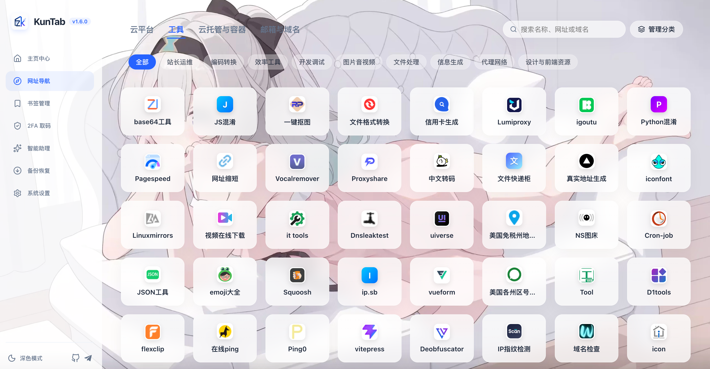

# 🌌 KunTab (WXT)

<p align="center">
  
</p>

<h3 align="center">KunTab</h3>

<p align="center">
  A premium, beautiful, and feature-rich Chrome New Tab browser extension for bookmarks management. Built with WXT, React 19, and TypeScript.
</p>

<p align="center">
  <a href="LICENSE"></a>
  <a href="https://wxt.dev/"></a>
  <a href="https://react.dev/"></a>
  <a href="https://www.typescriptlang.org/"></a>
</p>

<p align="center">
  🇺🇸 <b>English</b> | <a href="README.zh-CN.md">🇨🇳 简体中文</a>
</p>

---

## 📷 Screenshots

### 🌅 Dashboard


### 📂 Bookmarks Manager


### 🤖 AI Chat Assistant


### ⚡️ Quick Bookmarks & AI Suggestion


### 💾 Safe Backup & Restoration


### ⚙️ System Settings


### 🔑 2FA Authenticator (Locked/Unlock Screen)


### 🔑 2FA Authenticator (Unlocked/Dashboard Screen)


### 🌐 Site Navigator


---

## 📢 Changelog (版本更新记录)

### v1.7.0 (2026-06-21)
- 🌐 **新增网址导航功能**：主页新增模块化、高美感的网址导航页面，支持添加、编辑、删除网站及多级分类管理（树状选择器）。
- 🔍 **导航检索与搜索整合**：首页搜索框完美接入网址导航数据检索，支持快捷过滤和结果来源区分（书签 vs. 导航）。
- ✈️ **社交入口**：导航页新增 Telegram 频道/群组快捷加入图标。
- 🎨 **视觉与体验优化**：优化分类下拉选择器的层级显示（去除单调的连字符，采用优雅的缩进与指示器），并精简了空分类的直接删除逻辑。

### v1.6.0 (2026-06-20)
- 🎨 **全新 2FA 验证器看板设计**：将原本零散的 2FA 锁、搜索框、同步配置和账号列表统一整合进一个高透磨砂玻璃（Glassmorphism）质感的悬浮大面板中，页面更具整体美感。
- ⚡ **交互体验升级**：卡片的“复制、编辑、删除”操作更改为鼠标 Hover（悬停）时才淡入显现，大大节省空间；验证码使用大字号等宽（monospace）字体 and 微弱霓虹发光效果，点击整块卡片直接快速复制。
- ⏱️ **倒计时与搜索栏融合**：重构了倒计时圆环，其高度与搜索栏完全对齐，视觉布局更佳。
- ☁️ **云同步卡片精简**：精简为看板底部的一条小巧状态栏，只在需要时展开详细配置。
- 📱 **移动端响应式升级**：对 2FA 看板和账号卡片在窄屏下的表现进行了深度适配。

---

## ✨ Key Features

KunTab turns your browser's default New Tab page into an elegant, powerful dashboard centered around bookmark organization and daily utility.

### 🤖 AI Chat Assistant
- **Conversational UI**: Directly chat with a dedicated LLM assistant designed specifically for bookmark operations.
- **Smart Categorization**: Let the AI analyze your bookmark structures and suggest the best folder organization.
- **Duplicate Clean-up**: Scan, locate, and clean up duplicate bookmarks with a single click.
- **Related Site Suggestions**: Discover quality, relevant websites based on your collections or active topics.
- **Domain Interest Summaries**: Summarize key themes and topics within specific bookmark folders for review.

### ⚡️ Quick Bookmarks & Shortcuts
- **Global Keyboard Shortcut**: Toggle the quick bookmark popup instantly using `Alt + Shift + S` (Windows/Linux) or `⌥ Option + ⇧ Shift + S` (macOS).
- **Searchable Folder Selection**: Instantly search and filter through folder hierarchies inside the popup.
- **Inline Folder Creation**: Create new folders on the fly directly inside the search input.
- **✨ AI Folder Suggestion**: Click "AI Suggest" in the popup to let AI analyze the page title & URL and automatically recommend the best target folder with a clear reasoning.

### 🎨 Elegant Dashboard & UI Customization
- **Modern UI Elements**: Clean cards, translucent overlays, and glassmorphism styling that adapt seamlessly.
- **Custom Wallpaper**: Configure custom background images via setting URLs. Set contrast, background overlays, and blur intensity to ensure your content cards remain perfectly legible.
- **Multilingual Support**: Switch seamlessly between English and Simplified Chinese interfaces.
- **Deep Personalization**: Toggle between Light, Dark, or System Auto themes, customize font sizes, and enable a compact layout for maximum screen real estate.

### 🔍 Omnibox Search & Shorthand Shortcuts
- Custom default search engine configurations (Google, Baidu, Bing, GitHub, ChatGPT, YouTube).
- Direct address bar command shortcut prefixes. Type the prefix followed by your query to search specific platforms instantly:
  
  | Prefix | Search Engine | Example | Action |
  | :--- | :--- | :--- | :--- |
  | `g` | Google | `g react 19` | Search Google for "react 19" |
  | `bd` | Baidu | `bd kuntab` | Search Baidu for "kuntab" |
  | `b` | Bing | `b typescript` | Search Bing for "typescript" |
  | `gh` | GitHub | `gh wxt` | Search GitHub for repositories matching "wxt" |
  | `ai` | ChatGPT | `ai write a hook` | Send query "write a hook" directly to ChatGPT |
  | `yt` | YouTube | `yt lofi` | Search YouTube for "lofi" |

### 📂 Native Bookmarks Tree & Management
- Interactive sidebar displaying folder structures in real-time.
- Rich inline operations: create new folders, edit titles/URLs/parent folders, delete bookmarks, and mark bookmarks as "Frequently Used" links on the main grid dashboard.
- Custom dragging/sorting for frequently used bookmarks.
- Quick history list showing recently visited links using local caching.

### 🌐 Site Navigator
- **Categorized Dashboard**: Organize your favorite sites into multi-level categories for quick access.
- **Unified Search Integration**: Search both bookmarks and navigator sites directly from the home search bar.
- **Quick Customization**: Add, edit, or delete categories and websites with visual confirmation and clean dialogs.
- **Social Connect**: Quick access icon to join the Telegram group/channel directly from the navigator page.

### 💾 Safe Backup & Restoration
- **JSON Backup**: Export all custom bookmarks, folder hierarchies, dashboard settings, and quick links into a single secure file.
- **HTML Export**: Standalone bookmark export compatible with standard browsers.
- **R2/S3 Cloud Sync**: Configure Cloudflare R2 or standard S3-compatible object storage to manually sync KunTab settings and frequently used bookmarks; the native bookmark tree remains synchronized by the browser profile.
- **Smart Import**: Import your backup file without breaking your setup. The built-in duplicate-handling mechanism skips duplicate URLs automatically instead of wiping out existing configurations.
- Safety checks protecting user configurations from corrupted files (up to 10MB file limit).

---

## 🛠️ Technology Stack

- **Extension Framework**: [WXT](https://wxt.dev/) (Next-gen Web Extension Framework)
- **Frontend Core**: React 19 & TypeScript
- **Styling**: Vanilla CSS (Tailwind compatible and highly responsive layout)
- **Icons**: Lucide React
- **Manifest Version**: Manifest V3 (MV3) compatible with modern Chrome and Firefox architectures.

---

## 🚀 Getting Started

### Prerequisites

- Node.js (v18.x or later recommended)
- npm (or yarn / pnpm)

### Development Setup

1. **Clone the repository**:
   ```bash
   git clone https://github.com/quin95/KunTab-AI.git
   cd KunTab-AI
   ```

2. **Install dependencies**:
   ```bash
   npm install
   ```

3. **Start the development server**:
   ```bash
   npm run dev
   ```
   *This will launch a developer instance of Chrome with the extension automatically loaded and live-reloaded.*

4. **For Firefox development**:
   ```bash
   npm run dev:firefox
   ```

---

## 📦 Build & Package

To build the extension production bundle manually:

```bash
# Build for Chrome (creates .output/chrome-mv3)
npm run build

# Build for Firefox (creates .output/firefox-mv3)
npm run build:firefox

# Compile TypeScript and check errors
npm run compile

# Create a zip archive for Store publishing
npm run zip
npm run zip:firefox
```

---

## 🔧 Installing the Dev Build Manually

To run the built version on your daily browser:

### In Google Chrome / Edge
1. Open Chrome and navigate to `chrome://extensions/`.
2. Toggle on **Developer mode** (top right corner).
3. Click on **Load unpacked** (top left).
4. Select the `.output/chrome-mv3` folder inside your project directory.

### In Mozilla Firefox
1. Open Firefox and go to `about:debugging#/this-firefox`.
2. Click **Load Temporary Add-on...**.
3. Select the `manifest.json` file inside the `.output/firefox-mv3` directory.

---

## 📄 License

This project is licensed under the MIT License - see the [LICENSE](LICENSE) file for details.

---

<p align="center">Made with ❤️ by the KunTab Contributors</p>
