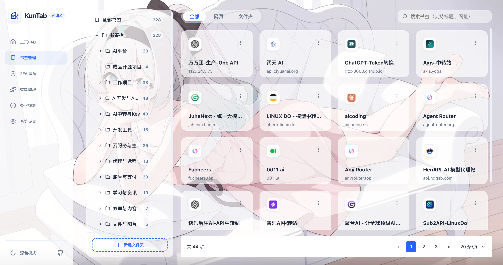

# 🌌 KunTab (WXT)

<p align="center">
  
</p>

<h3 align="center">KunTab</h3>

<p align="center">
  一款现代、优雅、功能丰富的新标签页 Chrome 浏览器插件，专为书签深度管理而设计。基于 WXT、React 19 和 TypeScript 构建。
</p>

<p align="center">
  <a href="LICENSE"></a>
  <a href="https://wxt.dev/"></a>
  <a href="https://react.dev/"></a>
  <a href="https://www.typescriptlang.org/"></a>
</p>

<p align="center">
  <a href="README.md">🇺🇸 English</a> | 🇨🇳 <b>简体中文</b>
</p>

---

## 📷 界面截图

### 🌅 仪表盘主页


### 📂 书签树管理器


### 🤖 AI 智能助理


### ⚡️ 快速收藏弹窗与 AI 推荐


### 💾 安全备份与恢复


### ⚙️ 个性化系统设置


### 🔑 2FA 动态验证器 (锁定/解锁界面)


### 🔑 2FA 动态验证器 (已解锁/取码界面)


---

## 📢 版本更新记录 (Changelog)

### v1.6.0 (2026-06-20)
- 🎨 **全新 2FA 验证器看板设计**：将原本零散的 2FA 锁、搜索框、同步配置和账号列表统一整合进一个高透磨砂玻璃（Glassmorphism）质感的悬浮大面板中，页面更具整体美感。
- ⚡ **交互体验升级**：卡片的“复制、编辑、删除”操作更改为鼠标 Hover（悬停）时才淡入显现，大大节省空间；验证码使用大字号等宽（monospace）字体和微弱霓虹发光效果，点击整块卡片直接快速复制。
- ⏱️ **倒计时与搜索栏融合**：重构了倒计时圆环，其高度与搜索栏完全对齐，视觉布局更佳。
- ☁️ **云同步卡片精简**：精简为看板底部的一条小巧状态栏，只在需要时展开详细配置。
- 📱 **移动端响应式升级**：对 2FA 看板和账号卡片在窄屏下的表现进行了深度适配。

---

## ✨ 核心特性

KunTab 将浏览器默认的新标签页替换为一个美观且强大的个人仪表盘，专注于书签整理、效率搜索和日常自定义使用。

### 🤖 AI 智能助理 (AI Assistant)
- **书签智能问答**：集成专门定制的书签大模型助手，支持直接对话交互。
- **智能分类整理**：AI 可以分析您的书签结构，帮助您对杂乱的书签进行分类与归档。
- **重复书签清理**：智能检测并一键清理重复或失效的网址，保持书签栏整洁。
- **相关网站推荐**：根据您的收藏内容或当前浏览主题，AI 自动推荐相关的高质量网站。
- **领域收藏总结**：一键让 AI 梳理并总结您在特定收藏领域的书签概况与核心主题。

### ⚡️ 快速收藏弹窗与快捷键
- **全局快捷键**：使用 `Alt + Shift + S` (Windows/Linux) 或 `⌥ Option + ⇧ Shift + S` (macOS) 一键唤起快速收藏弹窗。
- **文件夹智能检索**：在弹窗内支持通过关键字极速过滤已有的书签文件夹。
- **即时新建目录**：可直接在搜索输入框内输入新文件夹名称并一键创建保存。
- **✨ AI 智能推荐文件夹**：点击弹窗内的“智能推荐”，AI 将基于当前网页的 Title 与 URL，在您庞大的书签树中智能推荐并自动选中最合适的保存路径，并说明推荐理由。

### 🎨 极简美学仪表盘与 UI 定制
- **现代感 UI 设计**：平滑卡片、毛玻璃质感（Glassmorphism）与优雅的间距排版，完美融入您的日常使用。
- **自定义壁纸背景**：支持用户直接配置自定义背景图片 URL。同时支持调整对比度、遮罩层透明度、模糊度（Blur），确保在任何壁纸下卡片内容依然清晰可读。
- **中英文多语言**：完美适配中文与英文两种 UI 界面语言。
- **深度个性化配置**：支持明亮/暗黑/跟随系统主题切换，支持自定义字体大小，支持开启紧凑布局以提高屏幕信息展示密度。

### 🔍 命令行搜索与快捷前缀
- 支持设置默认搜索引擎（Google、百度、Bing、GitHub、ChatGPT、YouTube）。
- 输入框内置快捷前缀功能。在搜索框内输入对应前缀加空格，即可一键直接调用指定引擎搜索：

  | 快捷前缀 | 对应搜索引擎 | 示例 | 搜索动作 |
  | :--- | :--- | :--- | :--- |
  | `g` | Google | `g react 19` | 在谷歌搜索 "react 19" |
  | `bd` | 百度 | `bd kuntab` | 在百度搜索 "kuntab" |
  | `b` | Bing | `b typescript` | 在必应搜索 "typescript" |
  | `gh` | GitHub | `gh wxt` | 在 GitHub 搜索名为 "wxt" 的仓库 |
  | `ai` | ChatGPT | `ai write a hook` | 直接将 "write a hook" 提问发送给 ChatGPT |
  | `yt` | YouTube | `yt lofi` | 在 YouTube 搜索 "lofi" 视频 |

### 📂 原生书签树深度管理
- 左侧可折叠的树状文件夹导航栏，实时渲染本地书签结构。
- 丰富的行内交互操作：直接创建新文件夹、编辑书签标题/URL、移动所属文件夹、删除书签，并支持一键将其设为“常用书签”。
- 支持对“常用书签”进行拖拽排序和位置调整（自动同步保存）。
- 最近打开模块：基于本地缓存记录用户通过本插件点击打开的历史网页。

### 💾 安全的数据备份与恢复
- **JSON 备份**：一键导出所有书签树结构、设置参数、常用书签配置等完整数据到一个加密 JSON 文件中。
- **HTML 导出**：支持生成标准的 HTML 书签文件，可兼容导入到任意主流浏览器中。
- **R2/S3 云同步**：可配置 Cloudflare R2 或 S3 兼容对象存储，手动同步 KunTab 设置与常用书签；Chrome 书签树仍交给浏览器账号同步。
- **智能导入合并**：导入备份时采用“新增合并 + 重复跳过”的安全算法，自动过滤已存在的 URL，防止破坏或覆盖用户已有的书签和配置。
- 具备严格的校验逻辑，防止导入损坏的或过大（上限 10MB）的文件。

---

## 🛠️ 技术栈

- **插件框架**：[WXT](https://wxt.dev/)（新一代高性能浏览器插件开发框架）
- **前端核心**：React 19 & TypeScript
- **样式方案**：原生 Vanilla CSS（全响应式布局）
- **图标库**：Lucide React
- **规范版本**：采用 Manifest V3 (MV3) 规范，兼容主流 Chrome 与 Firefox 浏览器。

---

## 🚀 开发指南

### 前期准备

- 安装 Node.js（推荐 v18.x 或更高版本）
- 安装包管理器 npm（或 yarn / pnpm）

### 开发步骤

1. **克隆项目到本地**：
   ```bash
   git clone https://github.com/quin95/KunTab-AI.git
   cd KunTab-AI
   ```

2. **安装依赖依赖包**：
   ```bash
   npm install
   ```

3. **启动本地开发模式**：
   ```bash
   npm run dev
   ```
   *该命令将自动运行 WXT 并为您启动一个已经加载了该插件的 Chrome 纯净实例，支持热重载（Live Reload）。*

4. **针对 Firefox 进行开发**：
   ```bash
   npm run dev:firefox
   ```

---

## 📦 生产构建与打包

执行以下命令手动编译并打包插件：

```bash
# 编译 Chrome 插件版本 (输出目录: .output/chrome-mv3)
npm run build

# 编译 Firefox 插件版本 (输出目录: .output/firefox-mv3)
npm run build:firefox

# TypeScript 类型检查
npm run compile

# 压缩打包成 zip 包（用于发布至应用商店）
npm run zip
npm run zip:firefox
```

---

## 🔧 开发者模式手动安装步骤

如果您想在日常使用的浏览器中加载已经编译好的版本：

### 谷歌浏览器 (Chrome) / Edge 浏览器
1. 打开 Chrome 浏览器，访问 `chrome://extensions/`（扩展程序管理页面）。
2. 在右上角开启 **开发者模式** (Developer mode) 开关。
3. 点击左上角的 **加载已解压的扩展程序** (Load unpacked)。
4. 选择本项目目录下的 `.output/chrome-mv3` 文件夹。

### 火狐浏览器 (Firefox)
1. 打开 Firefox 浏览器，访问 `about:debugging#/this-firefox`。
2. 点击 **载入暂时的附加组件...** (Load Temporary Add-on...) 按钮。
3. 选择编译产物 `.output/firefox-mv3` 目录下的 `manifest.json` 文件。

---

## 📄 开源协议

本项目基于 MIT 协议开源 - 详情请参阅 [LICENSE](LICENSE) 文件。

---

<p align="center">Made with ❤️ by the KunTab Contributors</p>
